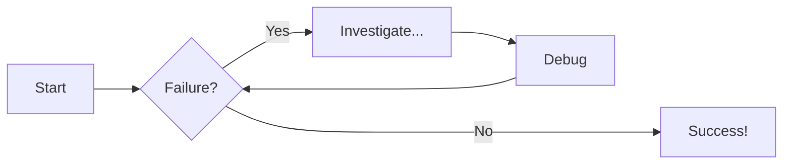
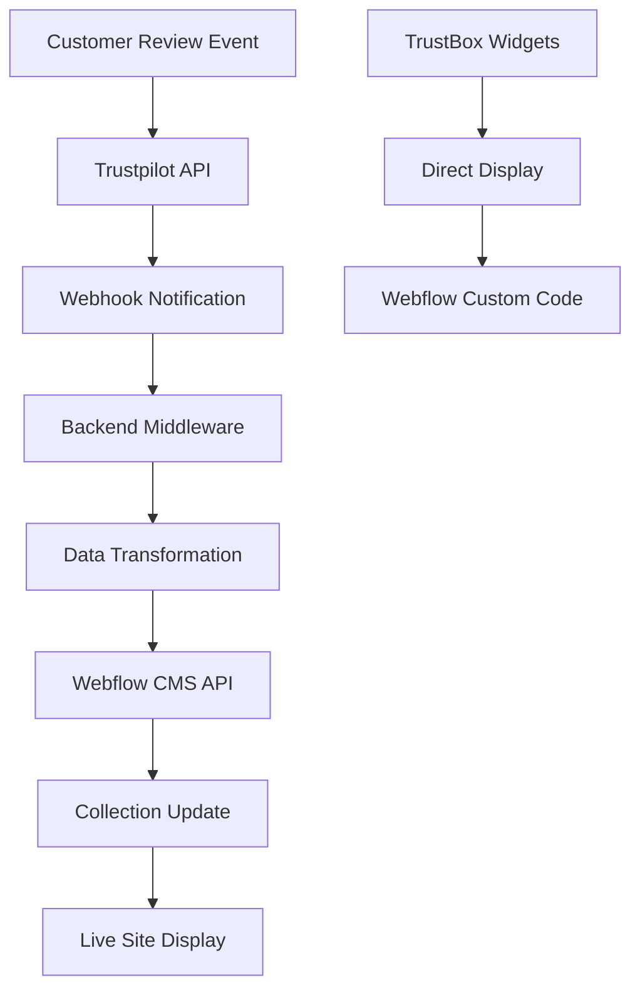
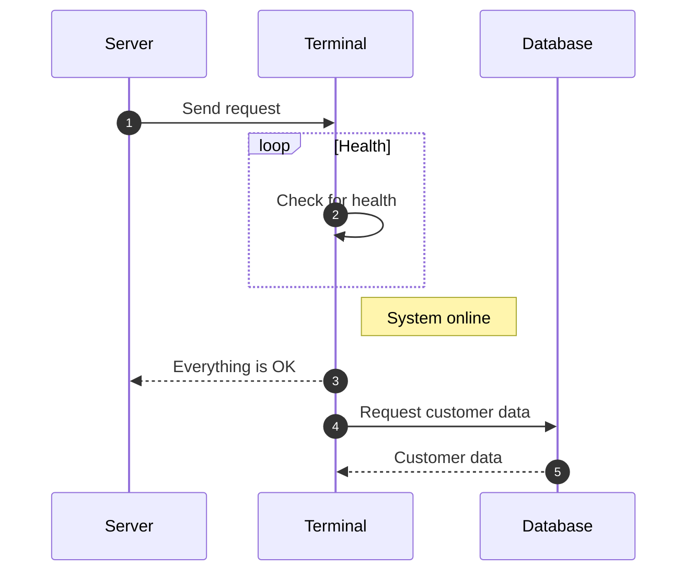

# Diagram Examples

## Flowchart1

```mermaid
graph LR
  A[Start] --> B{Failure?};
  B -->|Yes| C[Investigate...];
  C --> D[Debug];
  D --> B;
  B ---->|No| E[Success!];
```

## *Flowchart2*

```mermaid
graph TD
    A[Customer Review Event] --> B[Trustpilot API]
    B --> C[Webhook Notification]
    C --> D[Backend Middleware]
    D --> E[Data Transformation]
    E --> F[Webflow CMS API]
    F --> G[Collection Update]
    G --> H[Live Site Display]

    I[TrustBox Widgets] --> J[Direct Display]
    J --> K[Webflow Custom Code]
```

## Sequence Diagrams

```mermaid 
sequenceDiagram
  autonumber
  Server->>Terminal: Send request
  loop Health
      Terminal->>Terminal: Check for health
  end
  Note right of Terminal: System online
  Terminal-->>Server: Everything is OK
  Terminal->>Database: Request customer data
  Database-->>Terminal: Customer data
```