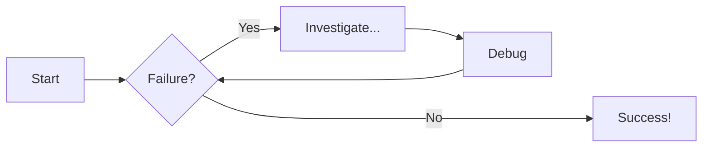
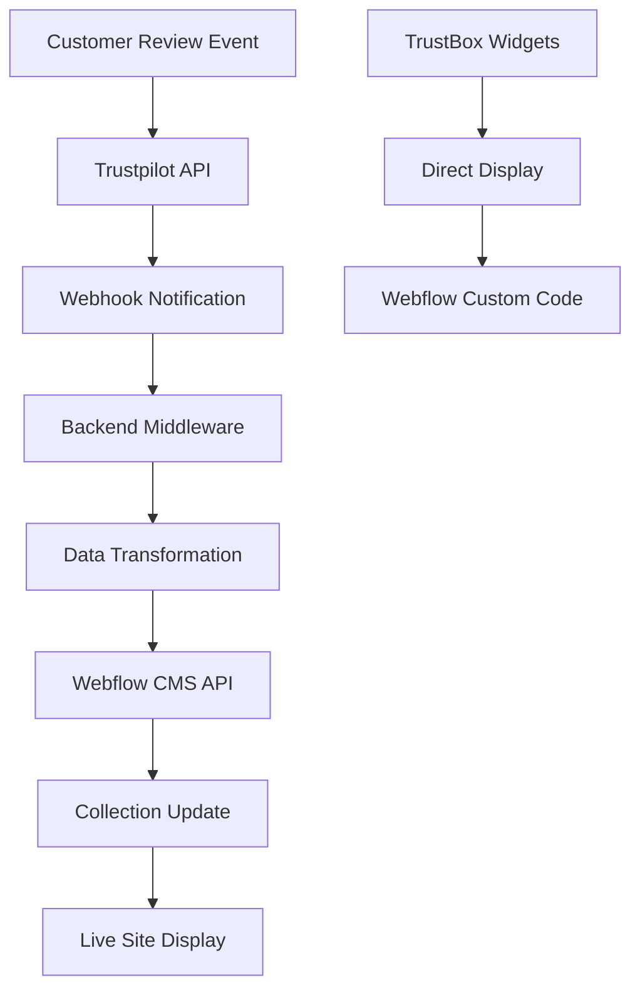
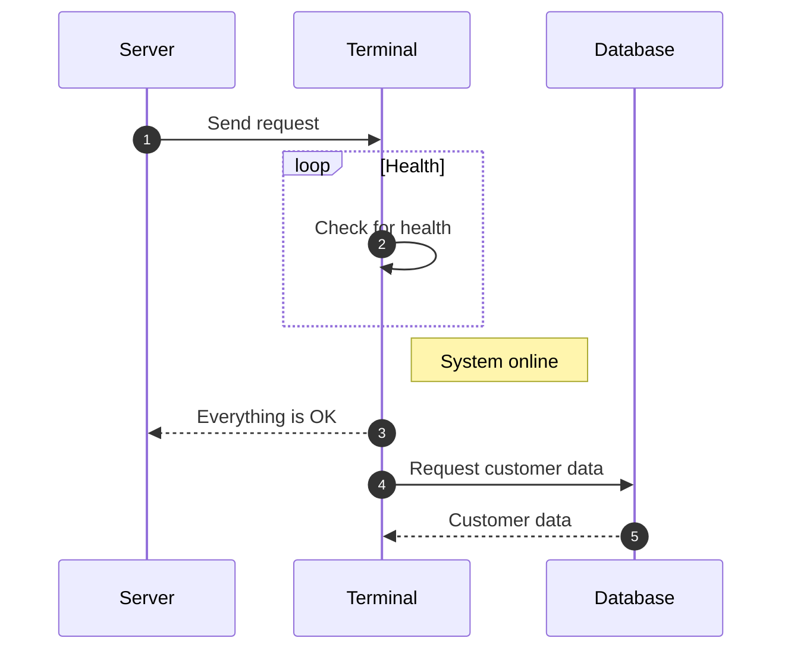
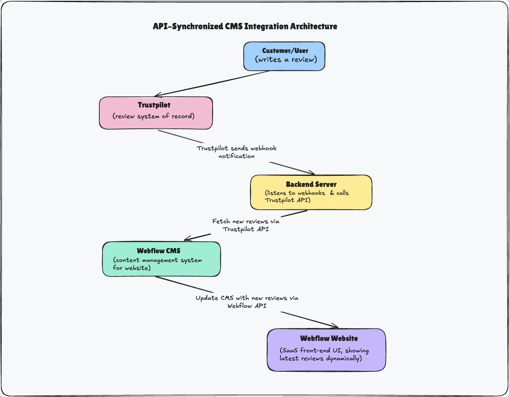
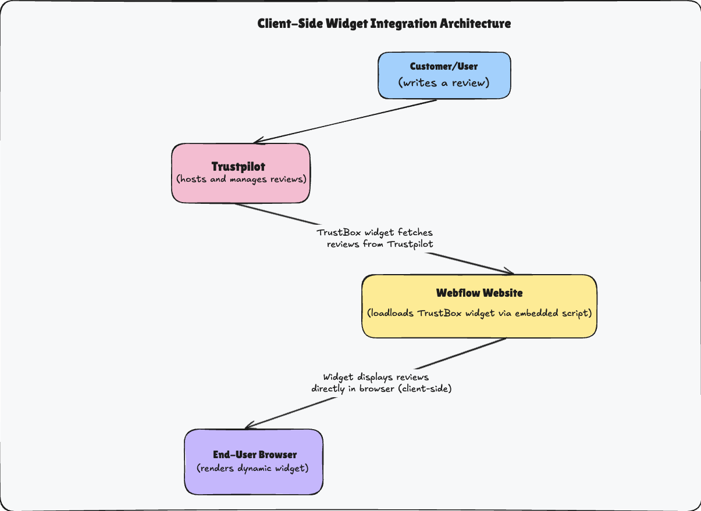

# 🧭 Diagram Examples

This page showcases how I use **Mermaid diagrams** within **Material for MkDocs** to make technical documentation more **visual, interactive, and developer-friendly**.

From system flows to API sequences and architectural overviews, diagrams help readers grasp complex ideas at a glance — especially in developer docs and product onboarding materials.

---

## ⚙️ Flowchart 1 — Debug & Process Loop

!!! note "What This Shows"
    This flowchart represents a basic debugging loop, where a process checks for failure conditions and iteratively resolves issues until success is achieved.
    It’s a great example of how procedural or troubleshooting logic can be visualized clearly.

     ✅ Use Case:
    Ideal for troubleshooting guides, testing workflows, or data validation processes in technical documentation.

## 💬 Flowchart 2 — Trustpilot & Webflow Integration

!!! info "Explaining the Flow"
    This diagram illustrates the data flow between Trustpilot and Webflow, showing how customer reviews move from event to live display.

    - **Trustpilot API** sends review data through a **webhook**.  
    - A **backend middleware** processes and transforms the data.  
    - The **Webflow CMS API** updates content dynamically.  
    - Reviews appear instantly on the **live site** or via **TrustBox Widgets**.

    ✅ Use Case:
    Useful in API documentation, integration guides, or DevRel tutorials to visualize backend–frontend data movement.

## 🔁 Sequence Diagram — Server to Database Communication

!!! tip "When to Use Sequence Diagrams"
    Sequence diagrams show time-ordered interactions between system components — perfect for APIs, webhooks, or service communications.

    In this example:
    - The **Server** requests health and data from a **Terminal**.  
    - The **Terminal** performs a health check and fetches customer data from a **Database**.  
    - Results are returned to the **Server**, confirming successful operation.

✨ Why I Use Mermaid Diagrams

!!! example "My Approach to Visual Documentation"
    - Clarity: Complex ideas are easier to understand visually.
    - Consistency: Diagrams align perfectly with Markdown-based docs — no external tools needed.
    - Maintainability: Easy to update as systems evolve.
    - Engagement: Visual content keeps readers focused longer.

    > I integrate diagrams directly into Markdown for live, version-controlled visuals that evolve alongside the codebase.

---

## 🎨 Excalidraw Diagrams — Visual Architecture & Concepts

Beyond code-based diagrams, I also create detailed visual diagrams using **Excalidraw** for complex architectural overviews, UI flows, and conceptual explanations.

### 🏗️ MCP Architecture Overview

!!! note "System Architecture Visualization"
    This diagram showcases the Model Context Protocol (MCP) architecture, illustrating how different components interact and communicate within the system.

    ✅ Use Case:
    Perfect for documenting system architectures, showing component relationships, and explaining technical concepts that require visual precision.

### 🤖 AI Framework Decision Flow

!!! info "Decision Flow Visualization"
    A comprehensive flowchart showing how to evaluate and choose the right AI framework for different use cases and requirements.

    ✅ Use Case:
    Ideal for creating decision trees, evaluation frameworks, and process documentation in product guides.

### 📱 API-CMS Integration

!!! tip "Integration Overview"
    This diagram illustrates the seamless integration between API services and CMS platforms, showing data flows and system interactions.

    ✅ Use Case:
    Great for API documentation, integration guides, and technical onboarding materials.

### 🧩 Widget Configuration

!!! example "UI Component Flow"
    Visual representation of widget configuration and integration within a web application.

    ✅ Use Case:
    Perfect for UI/UX documentation, component libraries, and frontend integration guides.
